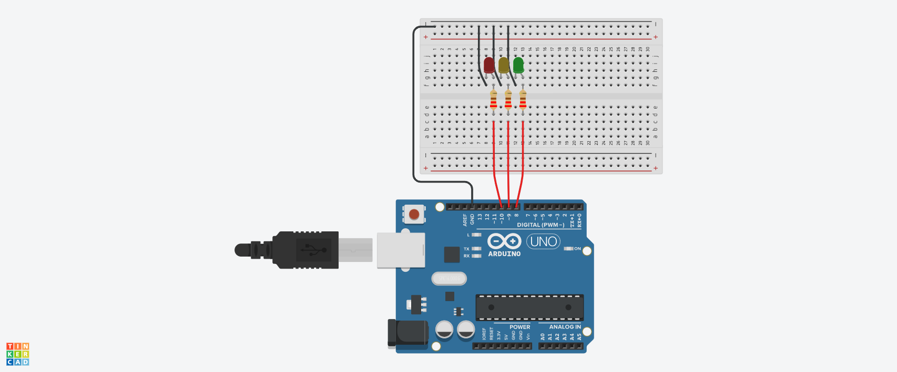

# Project 3 - Traffic Lights

## About

This is a simple Arduino project that simulates a Brazilian traffic light using three LEDs. The project consists of turning on the red light, waiting for 5 seconds, then turning it off and turning on the green light for another 5 seconds. After that, the green light turns off, the yellow light turns on for 2 seconds, and the loop repeats.

## Requirements

- Arduino board
- Three LEDs (red, yellow and green)
- Three 220-ohm resistors
- Jumper wires

## Installation

1. Connect the red LED to pin 10 of the Arduino board.
2. Connect the yellow LED to pin 9 of the Arduino board.
3. Connect the green LED to pin 8 of the Arduino board.
4. Connect the 220-ohm resistor between each LED's anode (+) and the respective pin of the Arduino board.
5. Connect the cathode (-) of all LEDs to the ground (GND) of the Arduino board.
6. Upload the code "project3.ino" to the Arduino board using the Arduino IDE.

## Usage

Once the code is uploaded to the Arduino board, the traffic lights will start to work. The red light will turn on for 5 seconds, then turn off, and the green light will turn on for another 5 seconds. After that, the yellow light will turn on for 2 seconds, and the loop will repeat.
